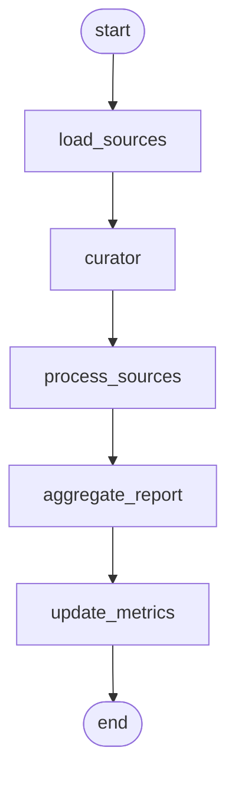
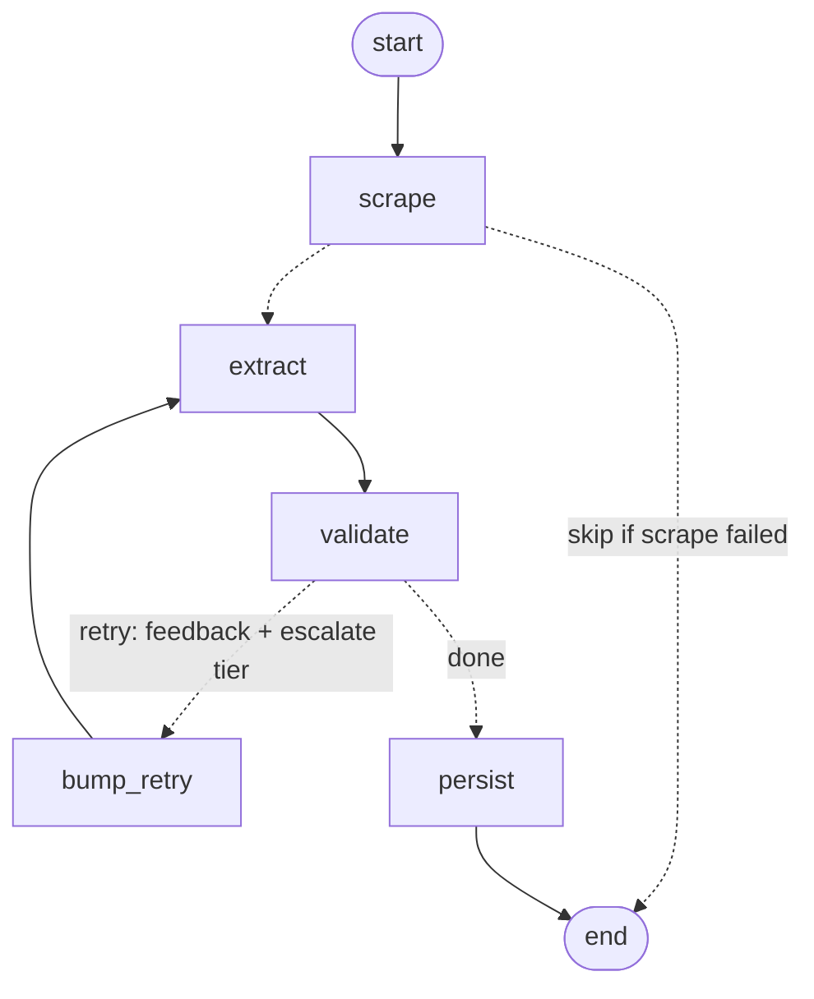

# EquiTable

AI-powered food pantry discovery platform. Searches for food pantries near any location, scrapes their websites, extracts structured data via Gemini LLM, and displays everything on an interactive Google Map with real-time streaming updates.

## How It Works

1. **Search any location** — Type a city or address into the map search bar
2. **Auto-discovery triggers** — When the map viewport has fewer than 3 pantries, discovery kicks in automatically
3. **Google Places API** finds food pantries — Runs 4 search queries ("food bank", "food pantry", "food distribution", "community food"), deduplicates by place ID
4. **Crawl4AI scrapes** each pantry's website — Async headless browser extracts page content as markdown
5. **Gemini 2.0 Flash extracts** structured data — Hours, eligibility, ID requirements, status, confidence score (1-10)
6. **Results stream live via SSE** — Pantry markers appear on the map in real-time as each one is processed
7. **Places without websites** are stored with basic Google data (confidence=3, "Limited info" flag)
8. **7-day cache** prevents redundant API calls for the same area

## Refresh Agent (LangGraph)

A standalone, scheduled background job (`backend_ml/agent/`) keeps stored pantry data fresh. It's a **LangGraph multi-agent state machine**, deployed to **AWS ECS Fargate** and triggered **every ~2 weeks by EventBridge Scheduler**, traced end-to-end in **LangSmith**.

- **Curator agent** ranks stale pantries (staleness + reliability + city diversity) and selects a budget-bounded batch.
- **Extraction subgraph** (per source): `scrape → extract → validate`, with a conditional **retry loop** that feeds validation/low-confidence signals back and **escalates the Gemini model tier** (`gemini-3.1-flash-lite → gemini-3.5-flash → gemini-3.1-pro-preview`).
- **Free-first scraping**: Crawl4AI, falling back to **Jina Reader** (free) for JS/anti-bot sites that Crawl4AI can't render — $0 scraping cost.
- **Cost-aware**: per-run USD budget halts the run cleanly; **MongoDB checkpointer** enables resume-on-crash + time-travel debugging.

### Parent graph (the refresh job)



### Extraction subgraph (runs per source)



**Run locally:** `cd backend_ml && python -m agent.refresh`
**Visualize/debug interactively (optional):** `cd backend_ml && langgraph dev` opens [LangGraph Studio](https://github.com/langchain-ai/langgraph-studio) for an interactive graph + run inspector. Requires `pip install "langgraph-cli[inmem]"` on **Python ≤ 3.13** (the local dev-server has no stable Python 3.14 build yet). For most needs the diagrams above plus the [LangSmith](https://smith.langchain.com) trace view are enough — Studio is a convenience, not required.
**Deploy / operate / tear down:** see [`docs/deploy-refresh-agent.md`](docs/deploy-refresh-agent.md)

## Features

- **Live Discovery** — Real-time food pantry discovery for any location in the US
- **Multi-Query Search** — 4 Google Places queries per discovery for maximum coverage
- **Place Details Fallback** — If a place has no website in search results, tries the Place Details API
- **AI Extraction** — Gemini 2.0 Flash extracts hours, eligibility, requirements from scraped HTML
- **Confidence Scoring** — Each pantry gets a 1-10 confidence score based on data quality
- **Interactive Map** — Google Maps with clustered markers, info windows, geospatial filtering
- **Viewport-Based Auto-Discovery** — Discovers pantries automatically when panning to new areas
- **SSE Streaming** — Server-Sent Events stream discovery progress in real-time
- **Geospatial Queries** — MongoDB 2dsphere indexes for fast nearby searches
- **Multi-City Support** — City/state filtering, seed data for major US cities
- **Result Caching** — 7-day MongoDB TTL cache on Places API results

## Project Structure

```
EquiTable/
├── backend_ml/                 # FastAPI backend
│   ├── main.py                 # API routes + rate limiter
│   ├── config.py               # Centralized environment settings
│   ├── database.py             # MongoDB Atlas connection + indexes
│   ├── models/
│   │   ├── pantry.py           # Pantry data model + GeoJSON
│   │   └── discovery.py        # Discovery job status + PlaceResult
│   ├── services/
│   │   ├── places_client.py    # Google Places API (multi-query + cache)
│   │   ├── discovery_service.py # Orchestrator: Places → dedup → scrape → store → SSE
│   │   ├── ingestion_pipeline.py # Crawl4AI → Gemini → Validator pipeline
│   │   ├── scraper.py          # Crawl4AI async web scraper
│   │   ├── metrics.py          # Prometheus counters + Pushgateway push (ADR-030)
│   │   ├── extractor.py        # Gemini LLM structured extraction
│   │   └── validator.py        # Field-level validation rules
│   ├── prompts/                # LLM system/example prompts
│   ├── tests/                  # 258 backend tests
│   └── requirements.txt
├── frontend/                   # React 19 + Vite 7
│   └── src/
│       ├── components/
│       │   ├── MapExperience.jsx      # Main map view with discovery integration
│       │   ├── PantryMapClean.jsx     # Google Map with markers + info windows
│       │   ├── PlaceSearchControl.jsx # Google Places Autocomplete on map
│       │   ├── DiscoveryOverlay.jsx   # Radar animation during discovery
│       │   ├── CitySelector.jsx       # City picker overlay
│       │   └── MapOverlay.jsx         # Stats overlay on map
│       ├── hooks/
│       │   ├── useViewportDiscovery.js # Auto-discovery on map pan/zoom
│       │   └── useDiscovery.js         # Discovery API + SSE hook
│       ├── services/
│       │   └── discoveryService.js     # Discovery API client
│       ├── pages/
│       │   └── UnifiedPage.jsx         # Single-page app layout
│       └── __tests__/                  # 104 frontend tests
├── k8s/                        # Kubernetes manifests (ADR-022 onward)
│   ├── 00-namespace.yaml
│   ├── 10-configmap.yaml       # Non-secret runtime config
│   ├── 11-secret.example.yaml  # TEMPLATE only — real Secret built from .env
│   ├── 15-serviceaccounts.yaml
│   ├── 20-api-deployment.yaml  # Probes, resources, security context
│   ├── 30-api-service.yaml
│   ├── 31-api-pdb.yaml
│   ├── 40-api-hpa.yaml
│   ├── 50-api-ingress.yaml     # TLS + SSE-friendly nginx annotations
│   ├── 60-refresh-cronjob.yaml # The scheduled refresh; injects REFRESH_RUN_ID
│   ├── 70-networkpolicy.yaml   # Deny-all baseline + narrow allows
│   ├── kind/cluster.yaml       # Local cluster (default CNI disabled, Calico)
│   └── monitoring/             # Helm values, ServiceMonitor, alert rules, dashboard JSON
├── scripts/
│   ├── k8s-up.sh               # Stand the whole stack up from scratch
│   ├── k8s-monitoring-up.sh    # Prometheus + Grafana + Pushgateway
│   └── k8s-tls-secret.sh       # Self-signed cert for the local Ingress
├── deploy/                     # Legacy ECS task-def + IAM policies (ADR-019)
├── docs/
│   ├── decisions.md            # Architecture Decision Records (ADR-001 to ADR-031)
│   └── seed-strategy.md        # Multi-city expansion plan
└── README.md
```

## Prerequisites

- Python 3.10+
- Node.js 18+
- MongoDB Atlas account (free M0 tier works)
- Google Cloud project with:
  - Maps JavaScript API enabled
  - Places API (New) enabled
- Google Gemini API key

## Getting Started

### Backend Setup

```bash
cd backend_ml
python3 -m venv venv
source venv/bin/activate
pip install -r requirements.txt
cp .env.example .env
# Edit .env with your API keys (see Environment Variables below)
uvicorn main:app --reload --host 127.0.0.1 --port 8000
```

### Frontend Setup

```bash
cd frontend
npm install
npm run dev
```

The app will be at `http://localhost:5173` with the API at `http://127.0.0.1:8000`.

## Running on Kubernetes

The API service and the refresh agent run on Kubernetes (ADR-022). The frontend stays on
Vercel — it is a static SPA on a CDN, and moving it into a cluster would lose the edge and gain
nothing.

The target is a local **kind** cluster, which keeps the marginal cost at **$0/month**.

### Prerequisites

```bash
brew install kind helm
brew install hashicorp/tap/terraform   # terraform left homebrew-core after the BSL change
```

Plus a running Docker daemon and a populated `backend_ml/.env` (see Environment Variables).
The Secret is built from that file at apply time and is never committed (ADR-028).

### Stand it up

```bash
./scripts/k8s-up.sh
```

Idempotent — safe to re-run. It will:

1. Create the kind cluster (`k8s/kind/cluster.yaml`) with the default CNI **disabled**
2. Install **Calico** — kind's built-in kindnet accepts NetworkPolicy objects and enforces
   nothing, so policies would be silently inert without this (ADR-027)
3. Install **ingress-nginx** and **metrics-server** (the HPA reads pod CPU from the metrics API;
   kind ships no metrics-server, so without it the HPA reports `<unknown>/70%` forever)
4. Build both images and `kind load` them into the cluster
5. Create the Secret from `backend_ml/.env`, apply the manifests, install a self-signed cert

The first build takes several minutes — the images install Chromium.

### Verify

```bash
kubectl get pods,svc,ingress,hpa,cronjob -n equitable

curl -k https://equitable.localtest.me/healthz/ready
curl -k https://equitable.localtest.me/pantries | head -c 400
```

`-k` because the local cert is self-signed. `localtest.me` resolves to `127.0.0.1` from any
resolver, which is what gives local HTTPS a real hostname — TLS certs cannot be issued for a
bare IP.

### Run a refresh now instead of waiting for the schedule

```bash
kubectl create job -n equitable --from=cronjob/equitable-refresh manual-$(date +%s)
kubectl logs -n equitable -l app.kubernetes.io/component=refresh-agent --follow
```

### Monitoring: Prometheus + Grafana

```bash
./scripts/k8s-monitoring-up.sh
kubectl port-forward -n monitoring svc/grafana 3000:80   # http://localhost:3000/d/equitable-scraper
kubectl get secret grafana-admin -n monitoring -o jsonpath='{.data.admin-password}' | base64 -d; echo
```

The scraper is instrumented to answer "how often does Crawl4AI need the Jina fallback?" with
per-attempt counters rather than a guess (ADR-030):

- `equitable_scrape_attempts_total{method,outcome}`: every tool *tried*, labelled `success`,
  `insufficient` or `failed`.
- `equitable_scrape_results_total{method}`: the tool that *won* for each URL (or `none`). This is the
  split.
- `equitable_scrape_duration_seconds{method}`: per-attempt latency.

The two processes report differently. The **API** is scraped (pulled) on port 9464, which is not a
route: the Ingress forwards every path, so a `/metrics` route would be public. The port is reachable
only from Prometheus's pods (NetworkPolicy). The **refresh CronJob** lives for minutes every two
weeks, which a 30s scrape would miss, so it **pushes once at the end of the run** to a Pushgateway,
grouped by `run_id`. Both are off unless `METRICS_PORT` / `PUSHGATEWAY_URL` are set, and a failed
push never fails a run.

The stack is kube-prometheus-stack, trimmed for kind: no Alertmanager, node-exporter or
control-plane scraping, and 4 project alert rules (ADR-031). The dashboard JSON lives in
`k8s/monitoring/dashboards/` and is loaded by Grafana's sidecar.

**What the numbers say so far.** Across the pantry records in Atlas (last successful tool per
pantry), **74% came from Crawl4AI and 26% from the Jina fallback** (95 / 33 of 128). The Prometheus
counters add what that record can't: failures, per-attempt fallback rate, and history across runs.
They have one verified capped run so far, so the dashboard number should be taken over the Mongo
one only after several fortnightly runs.

### Exercise the failure modes

These are the behaviors worth checking, because each one is a claim that would otherwise be
untested.

**Readiness fails when MongoDB is unreachable, liveness does not.**

Note what does *not* work: pointing the Secret at a dead host and restarting. The app's lifespan
calls `connect_to_mongo()` and re-raises on failure, so a pod that cannot reach Mongo **at startup**
never serves at all. Verified behavior: it blocks ~30s on pymongo server selection, then exits with
`ServerSelectionTimeoutError` and `Application startup failed. Exiting.` Under the Deployment that is
a CrashLoopBackOff, and the readiness probe never gets to report anything — a different failure from
the one the probes exist for. (Whether failing closed at startup is the right call is a separate
question; see "What this does not prove".)

To test the probe, break Mongo for *running* pods. Removing 27017 from the egress allow-list is not
enough on its own either — NetworkPolicy governs new flows, and the existing pooled connection keeps
working (pymongo's streaming heartbeat holds it open), so readiness correctly stays green because the
pod genuinely can still serve. Both the new flow and the established one have to go:

```bash
# 1. Remove 27017 from the egress allow-list (NetworkPolicy is allow-only, so
#    removing the allow IS the block).
kubectl patch networkpolicy allow-external-egress -n equitable --type=json \
  -p '[{"op":"replace","path":"/spec/egress/0/ports","value":[{"protocol":"TCP","port":443},{"protocol":"TCP","port":80}]}]'

# 2. Drop the already-established Mongo flows on the node.
docker exec equitable-worker conntrack -D -p tcp --orig-port-dst 27017

# 3. Observe: NOT ready, but still Running with RESTARTS 0.
kubectl get pods -n equitable -l app.kubernetes.io/component=api \
  -o custom-columns='POD:.metadata.name,READY:.status.containerStatuses[0].ready,RESTARTS:.status.containerStatuses[0].restartCount'
kubectl get endpointslice -n equitable -l kubernetes.io/service-name=equitable-api \
  -o jsonpath='{range .items[*].endpoints[*]}{.addresses[0]}{" ready="}{.conditions.ready}{"\n"}{end}'
```

Observed: readiness flips in ~2s to
`503 {"status":"unready","dependency":"mongodb","error":"ping exceeded 2.0s budget"}`, liveness stays
`200`, **RESTARTS stays 0**, and both endpoints go `ready=false`.

`RESTARTS 0` is the whole point: a Mongo outage takes the pods out of rotation but does not kill
them, because liveness is deliberately dependency-free (ADR-025). Restore and watch it recover
without a restart — it is level-triggered, not latched:

```bash
kubectl apply -f k8s/70-networkpolicy.yaml   # recovers in ~4s, RESTARTS still 0
```

**A pod killed mid-crawl resumes rather than restarting the work.** Delete the pod during a run;
the replacement belongs to the same Job, so it inherits the same `REFRESH_RUN_ID` and resumes the
same LangGraph checkpoint thread (ADR-024):

```bash
kubectl create job -n equitable --from=cronjob/equitable-refresh resume-test
kubectl delete pod -n equitable -l job-name=resume-test --force   # kill mid-run
kubectl logs -n equitable -l job-name=resume-test | grep refresh_resumed
```

The `refresh_resumed` log line reports `already_processed`, the count of sources carried over from
the dead pod.

**The CronJob refuses to overlap.** `concurrencyPolicy: Forbid` — start a long run, fire a second
Job, and the second is skipped rather than run concurrently.

### Tear down

```bash
kind delete cluster --name equitable
```

Nothing outside the cluster is touched: the ECS deployment (ADR-019), Atlas, and Vercel are all
left as they are.

### What this does not prove

Being honest about the boundary matters more than the demo:

- This runs on **one laptop with no real traffic**. It proves the manifests are correct and the
  workloads run. It proves nothing about behavior under load, node failure, a control-plane
  upgrade, or a real rollout gone wrong.
- **Resource requests and limits are estimates, not measurements** (ADR-026). They are anchored to
  the ECS task that runs the same code, then given headroom. Nobody has profiled this under
  representative traffic, because there is no representative traffic.
- **The HPA scales on CPU, which is the wrong signal here.** The API is I/O-bound; it will saturate
  on concurrent scrapes and Mongo round-trips long before CPU reaches the 70% target. CPU is what
  `autoscaling/v2` offers without a custom-metrics adapter. Known weakness, not an oversight.
- **A laptop is not a scheduler.** The dashboard showed the Sep 15 run was simply missed: the
  cluster was off at fire time, `startingDeadlineSeconds` (1h) expired, and `Forbid` drops rather
  than queues. The *Next scheduled run* panel goes red when this happens. On ECS/EventBridge it would
  not have been missed.
- **Resume is at node granularity, not per source** (ADR-020, ADR-024). A crash mid-fan-out
  re-executes the whole `process_sources` node and re-scrapes that run's selected sources. This is
  safe — upserts are idempotent and the 24h freshness floor makes re-refreshes no-ops — but it is
  re-work, not incremental resume.
- Secrets are base64 in etcd, not encrypted (ADR-028). Fine for a single-user local cluster; not
  fine for anything shared.
- **The API fails closed at startup, not gracefully.** If MongoDB is unreachable when a pod boots,
  the lifespan re-raises and the process exits, so the pod CrashLoopBackOffs rather than starting up
  and reporting itself unready. That means an Atlas outage during a rollout takes the deployment
  down hard, and `maxUnavailable: 0` is what stops it taking the *existing* pods with it. Starting
  unready and retrying the connection in the background would degrade more gracefully; the probes
  are already built for it. Not changed here because it is an application-behavior change, and this
  work was scoped as a deployment migration.

### Design Q&A

Short answers to the questions this setup should be able to survive.

**Why Kubernetes here rather than ECS or a plain VM?**
Two honest halves. The non-technical half: the target roles screen for it, and this project existed
to make that claim true. The technical half stands on its own — three things genuinely improved.
Overlap protection became declarative (`concurrencyPolicy: Forbid`); EventBridge fires on schedule
with no idea whether the previous task is still running, and two concurrent crawls would double
Gemini spend against a per-process budget and race on the same documents. The API gained
probe-gated rollouts with `maxUnavailable: 0`, so a broken image never displaces a working one.
And the system became one reviewable directory instead of two consoles plus a runbook. That said,
for a fortnightly batch job and a low-traffic API this is more machinery than the workload needs.
ECS was sufficient. (ADR-022)

**What do the probes check, and why is a naive `200` worse than useless?**
Liveness (`/healthz/live`) is dependency-free and answers "is this process wedged?" — a failure
*kills* the pod. Readiness (`/healthz/ready`) pings MongoDB with a 2s budget and answers "can this
pod serve right now?" — a failure only removes it from Service endpoints. Conflating them is
actively harmful: a Mongo-checking liveness probe turns a recoverable Atlas blip into a
cluster-wide CrashLoopBackOff, because restarting cannot fix a dependency outage. A hardcoded
`200` is worse than no check because it converts "obviously down" into "green while every request
500s" — the load balancer keeps routing to a pod that cannot serve. The timeout matters as much as
the check: an unbounded probe never reports unready, so it would keep a hung pod in rotation.
Verified in-cluster: readiness flipped to `503 ping exceeded 2.0s budget` in ~2s, liveness stayed
`200`, restarts stayed `0`, and it recovered in ~4s without a restart. (ADR-025)

**What happens when the CronJob fires while the previous run is still going?**
`concurrencyPolicy: Forbid` skips the new run. Note what that does *not* do — it does not queue it;
that firing is dropped and the next is a fortnight away. Acceptable because the job is idempotent
(upserts keyed on `source_url`) and the 24h freshness floor means a missed run only means slightly
staler data. At an hourly cadence this would be the wrong policy. (ADR-023)

**What are the resource requests and how were they picked?**
API 200m/512Mi requests, 1000m/2Gi limits; agent 500m/1Gi, 2/4Gi. The agent numbers are anchored to
the ECS task running the same code at 2 vCPU / 4 GiB. Memory limits are deliberately generous
because they are enforced by OOM-kill, not throttling, and `/pantries/discover` spawns Chromium
in-process. The honest part: measured idle usage is **7–8m CPU and ~112 MiB**, so the CPU request is
probably 2–4x too high and the memory request is defensible only because of the un-measured
Chromium spike. These are estimates with one idle data point, not a profile. (ADR-026)

**What would you do differently at 100x traffic?**
The CPU-based HPA would be the first thing to go — this API is I/O-bound and would saturate on
concurrent scrapes and Mongo round-trips long before CPU hit the 70% target, so it would sit still
while latency climbed. Replace it with a concurrency- or p99-latency-based metric via a
custom-metrics adapter. Second, discovery's in-process Chromium doesn't belong in the request path
at that scale; it should be a queue and a worker pool so a slow scrape can't occupy an API pod.
Third, the in-memory per-IP rate limiter is per-pod, so it silently multiplies by the replica count —
it needs shared state. Fourth, resume granularity: a crash mid-fan-out currently re-scrapes the
whole batch, which is cheap at 25 sources and not at 2,500.

**How do you know the Crawl4AI/Jina split?**
Two sources, with different meanings. Mongo's `scrape_method` gives the last successful tool per
pantry: 74% Crawl4AI / 26% Jina. The honest limits are that failures are never written and every
run overwrites the last. Prometheus counts every attempt and every outcome per run, including
`none`. The job is short-lived, so it pushes to a Pushgateway grouped by `run_id`; a constant key
would make each run overwrite the previous one. The metric I'd actually alert on is the fallback
trigger rate, because Crawl4AI degrading shows up there before pantries go stale. (ADR-030)

**What do you still not know?**
This has never run under real traffic. Everything here was verified on a two-node kind cluster on a
laptop, so it proves the manifests are correct and the failure modes behave as designed — and
nothing about behavior under load, node failure, or a control-plane upgrade. Specifically unproven:
no scheduling problem has been debugged under contention, no rollout has been observed going wrong
in production, the resource numbers are one idle measurement, the autoscaling has never actually
scaled anything, and the Terraform Atlas resources are written and validated but never applied. One
known unfixed weakness: the API fails closed at startup — if Atlas is unreachable when a pod boots
it exits rather than starting unready and retrying, so an Atlas outage during a rollout takes the
deployment down hard.

## Environment Variables

### Backend (`backend_ml/.env`)

```bash
MONGO_URI=mongodb+srv://...          # MongoDB Atlas connection string
DATABASE_NAME=equitable              # Database name (default: equitable)
GEMINI_API_KEY=AIza...               # Google Gemini API key
GOOGLE_PLACES_API_KEY=AIza...        # Google Places API key (same GCP project as Maps)
```

### Frontend (`frontend/.env`)

```bash
VITE_GOOGLE_MAPS_KEY=AIza...         # Google Maps JavaScript API key
VITE_API_URL=http://127.0.0.1:8000   # Backend API URL
```

## API Endpoints

| Method | Endpoint | Description |
|--------|----------|-------------|
| GET | `/` | Health check |
| GET | `/pantries` | List pantries (optional `?city=X&state=Y` filter) |
| GET | `/pantries/nearby` | Geospatial search (`?lat=X&lng=Y&radius=Z`) |
| GET | `/cities` | City list with counts and map centers |
| POST | `/pantries/discover` | Start discovery job (returns `job_id` + SSE stream URL) |
| GET | `/pantries/discover/stream/{job_id}` | SSE event stream for live discovery progress |
| GET | `/pantries/discover/status/{job_id}` | Polling fallback for discovery status |
| POST | `/pantries/{id}/ingest` | Re-scrape + extract a single pantry |

## Testing

```bash
# Backend — 258 tests
cd backend_ml
source venv/bin/activate
python -m pytest tests/ -v

# Frontend — 104 tests
cd frontend
npm run test
```

## Tech Stack

### Backend
- **FastAPI** — Async Python web framework
- **Motor** — Async MongoDB driver
- **Crawl4AI** — Headless browser scraper (replaced Firecrawl)
- **Google Gemini 3** — LLM extraction, cheap-first 3-tier model ladder (ADR-018)
- **Google Places API (New)** — Food pantry discovery
- **SSE-Starlette** — Server-Sent Events for real-time streaming
- **httpx** — Async HTTP client for Google APIs

### Frontend
- **React 19** + **Vite 7** — UI framework + build tool
- **Tailwind CSS 4** — Utility-first styling
- **@vis.gl/react-google-maps** — Google Maps React wrapper
- **Framer Motion** — Animations (discovery overlay, marker transitions)
- **Vitest** — Test runner

### Infrastructure
- **MongoDB Atlas** — Database with 2dsphere geospatial indexes (free M0 tier)
- **Vercel** — Frontend hosting
- **Render** — Backend hosting (being migrated to Kubernetes, ADR-022)
- **Kubernetes** — API Deployment + refresh CronJob, local `kind` cluster
- **Prometheus + Grafana** — kube-prometheus-stack + Pushgateway for the CronJob (ADR-030/031)
- **AWS ECS Fargate + EventBridge** — the refresh agent's current production home (ADR-019)

## Cost

Most services are on free tiers. **Scraping is $0** — that is the claim ADR-021 protects, by
keeping Crawl4AI + Jina Reader as the default chain and leaving paid Firecrawl off.

The system as a whole is **not** $0. Current running cost is roughly **$1.50–3/month**:

| Component | Cost | Note |
|---|---|---|
| AWS ECS Fargate + EventBridge | ~$1–2/mo | The refresh agent's production home (ADR-019). Public subnet, no NAT — a NAT Gateway would be ~$32/mo and dwarf the job. |
| Gemini (refresh runs) | ~$0.50–1/mo | Capped per run by `REFRESH_MAX_COST_USD` |
| Prometheus / Grafana | $0 | In-cluster on kind; nothing leaves the laptop (ADR-031) |
| Kubernetes (local `kind`) | $0 | Runs on the laptop. A managed control plane would be ~$72/mo before any nodes. |
| Scraping | $0 | Crawl4AI → Jina fallback (ADR-021) |

Everything below is free at current volume:

| Service | Free Limit | Cost After |
|---------|-----------|------------|
| Google Places API | 1,000 requests/month | $32/1K requests |
| Google Maps JS | $200/month credit | $7/1K loads |
| Gemini 2.0 Flash | 15 RPM, 1M tokens/day | $0.075/1M input |
| MongoDB Atlas M0 | 512MB storage | ~$9/month for M2 |
| Render | 750 hours/month | $7/month always-on |
| Vercel | Hobby tier | $20/month Pro |

## Architecture Decisions

Key decisions are documented in `docs/decisions.md` (ADR-001 through ADR-031). Highlights:

- **ADR-008**: Crawl4AI replaces Firecrawl as primary scraper ($0 cost vs $0.01/page)
- **ADR-011**: Google Places API (New) for pantry discovery
- **ADR-012**: SSE for real-time discovery streaming
- **ADR-014**: Multi-query Places search with 7-day caching
- **ADR-022**: Kubernetes for the API + refresh agent (supersedes ADR-019's topology)
- **ADR-024**: A stable `thread_id` — making resume-on-crash actually work
- **ADR-025**: Real health probes, and why liveness must not check MongoDB
- **ADR-030**: Scraper metrics — pull for the API, Pushgateway for the CronJob

## License

MIT
